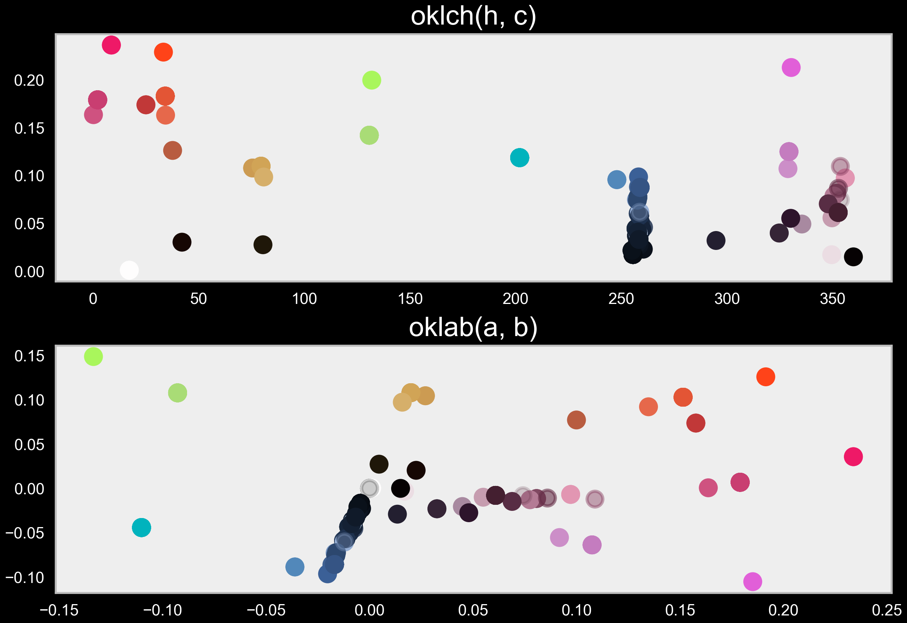

# 🎨 ReThemizer (WIP)

A python tool to smartly create and modify color themes.

## Contents <!-- omit from toc -->

- [✨ Features](#-features)
  - [Incoming](#incoming)
- [📸 Screenshots](#-screenshots)
  - [Colors in different color spaces](#colors-in-different-color-spaces)
  - [Possible Clustering Solutions](#possible-clustering-solutions)
  - [Individual Clusters](#individual-clusters)

## ✨ Features

- Visualize all colors of a theme in different color spaces (HSL, OKLAB, OKLCH, etc).
- Cluster colors with regard of their coordinate in one or a combination of color spaces.
  - Manual update of clusters for fine grained modifications is possible.
- Batch modify all colors of clusters to smartly change the colors of your favorite themes while keeping the balance between colors.
- Export modified colors as a new theme automatically.

### Incoming

- GUI for color manipulations and visualization.

## 📸 Screenshots

  
Click to expand screenshots

### Colors in different color spaces

### Possible Clustering Solutions

Inner color = color of the center of the cluster

_plot.png>)

### Individual Clusters

_9_clusters.png>)
